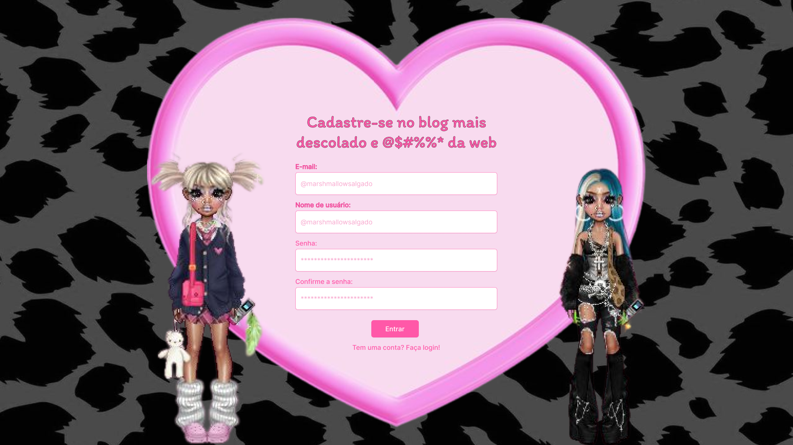

# GyarUGirls
Uma rede social inspirada nos sites japoneses dos anos 2000, blogs do Tumblr + uma pitadinha de Twitter.
Seu novo cantinho favorito da internet ;) 

  

  

  

## Pré-requisitos
- Certifique-se de que você tenha o PHP instalado em seu sistema. Você pode verificar a instalação do PHP digitando o seguinte comando no seu terminal:
php -v

- Tenha um servidor web, como o Apache, configurado e em execução.

## Passo 1: Configurar o Servidor Web
Certifique-se de que seu servidor web (por exemplo, Apache ou Nginx) esteja configurado e em execução em seu ambiente de desenvolvimento.

## Passo 2: Colocar os Arquivos do Projeto
Clone ou baixe um .zip do projeto "GyarUGirls" em um diretório acessível pelo servidor web. Por exemplo, se você estiver usando o Apache, coloque o projeto no diretório "htdocs", dentro do diretório de instalação do Apache.

## Passo 3: Acessar a Página Inicial
Abra um navegador da web e digite "localhost" na barra de endereço. Isso deve exibir a página padrão do servidor web.

## Passo 4: Visualizar o Projeto
Navegue até o diretório de "GyarUGirls", e digite "localhost/GyarUGirls" na barra de endereço do navegador.

Se tudo estiver configurado corretamente, você deverá ver a página inicial do projeto no navegador.

  

  

## Um beijo e um queijo, e até a próxima! :heart:

  

